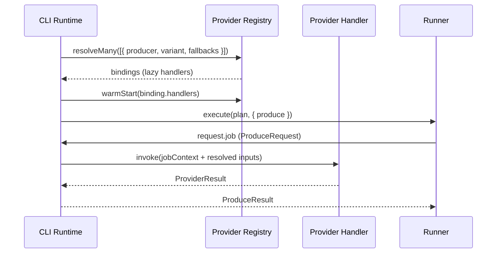

# CLI Provider Interaction Architecture

This document describes how the Tutopanda CLI resolves providers, orchestrates builds with the core runner, and feeds artefacts back into storage. The goal is to make provider selection, fallback, and execution behaviour entirely predictable from CLI inputs.

## Overview

```
tutopanda query / tutopanda edit
    ↓
load CLI config (default-settings.json + overrides)
    ↓
derive provider variants per producer (primary + fallbacks)
    ↓
resolve handlers through tutopanda-providers registry
    ↓
construct ProduceFn wrapper
    ↓
invoke core runner with plan + manifest
    ↓
provider handlers run jobs, artefacts persisted by core/storage
```

The CLI never talks to provider SDKs directly. All interactions flow through the provider registry described in `providers/docs/provider-api.md`, keeping the CLI focused on configuration, orchestration, and user interaction.

## Inputs & Data Sources

- **CLI settings** (`~/.tutopanda/default-settings.json` + per-run overrides) declare producer → provider priorities and custom attributes. This file may include fallbacks, environment hints, and per-provider config files.
- **Execution plan** (`ExecutionPlan` from `tutopanda-core`) lists jobs by producer kind, including the `provider` and `providerModel` selected during planning.
- **Manifest & event log** ensure the runner can detect incremental changes and persist artefacts.
- **Secrets** come from the CLI runtime (typically environment variables) and are passed to the provider registry via a `secretResolver`.

## Lifecycle Hooks

1. **Initialisation**
   - `tutopanda init` creates storage directories and base config.
   - Subsequent commands read settings, prompt the user for overrides if needed, and prepare runtime context (logger, telemetry ids, etc.).

2. **Plan Loading**
   - Whenever the user runs `tutopanda query <prompt>` or `tutopanda edit --movieId=<id>`, the CLI invokes `generatePlan` from `tutopanda-core` to produce the fresh `ExecutionPlan` + manifest snapshot that will seed the run.
   - `query` creates a brand-new movie directory, merges default settings with inline overrides, and stores the computed plan as the initial state before any providers run.
   - `edit` loads the existing movie config/prompts first, applies overrides (including any TOML edits), and regenerates the plan so revisions start from the current manifest.
   - If the plan references producers without explicit provider data, CLI merges defaults from `tutopanda-providers` `producerCatalog`.

3. **Provider Resolution**
   - CLI maps each producer in the plan to a `ProviderVariant` (provider, model, environment) and optional fallback variants using the configuration document.
   - It sends a batch request to `registry.resolveMany` to obtain handler bindings up front (handles warm start and error surfacing early).

4. **Runner Execution**
   - CLI composes a `ProduceFn` via `createProviderProduce(registry, resolutionCache, observabilityHooks)` and injects it into `createRunner`.
   - During execution, the runner invokes the produce function per job; artefact persistence and manifest updates happen inside core.

5. **Wrap-up**
   - CLI outputs run summaries, writes manifests to disk, and surfaces diagnostics (provider latencies, fallback usage) to the user.

## Provider Resolution Workflow



- `warmStart` is optional; when supported the CLI runs it in parallel prior to starting the runner to surface secret/config issues early.
- Resolution errors (missing provider, invalid environment, unresolvable fallback) are thrown before the runner starts, failing fast.

## Data Structures

```ts
// Derived from CLI configuration
interface CliProviderPreference {
  producer: ProducerKind;
  primary: ProviderVariant;
  fallbacks: ProviderVariant[];
}

interface ProviderVariant {
  provider: ProviderName;
  model: string;
  environment: 'local' | 'cloud';
  overrides?: Record<string, unknown>; // parsed config objects merged into job.context.providerConfig
}

// Cached per run
type ProviderBindingCache = Map<JobDescriptor['jobId'], ResolvedBinding>;
```

- The CLI expands `overrides` (custom attributes, prompt configs, reasoning level, etc.) into `job.context` before handing the job to the handler.
- When a provider needs the original file bytes (rather than just parsed data), the CLI also includes them under `job.context.rawAttachments` so handlers can rehydrate prompts verbatim.
- For jobs generated via replay/edit flows, the CLI recomputes the cache only for changed producers.

## Execution Flow Example

### Script Generation with Fallback

1. `default-settings.json` declares:
   ```json
   {
     "producer": "ScriptProducer",
     "providers": [
       { "priority": "main", "provider": "openai", "model": "openai/gpt5", "environment": "cloud" },
       { "priority": "fallback", "provider": "replicate", "model": "google/gemini-2.5-flash", "environment": "cloud" }
     ]
   }
   ```
2. CLI resolves both variants. The registry prepares handlers:
   - Primary: OpenAI via Vercel AI SDK, warm start ensures API key present.
   - Fallback: Replicate call to Gemini.
3. Runner invokes job:
   - CLI builds `ProviderJobContext` that includes the job metadata plus parsed provider configuration objects (e.g. TOML → JSON) in `context.providerConfig`, along with any raw attachments if the provider needs to rehydrate original files. The CLI does not interpret the meaning of these fields—it simply forwards them exactly as defined in the settings.
   - Primary handler succeeds, returning artefacts for `MovieTitle`, `MovieSummary`, segment scripts. CLI adapts result into `ProduceResult`.
4. Manifest is updated with new artefacts; CLI logs `provider.invoke.end` with metadata for user visibility.

### Audio Producer Fallback Trigger

1. Primary ElevenLabs voice (`environment: "cloud"`) hits a 429; handler throws `ProviderFailure` flagged as retryable.
2. Produce wrapper catches the failure, records diagnostics, and invokes fallback variant (Replicate `minimax/speech-02-hd`).
3. Fallback succeeds. CLI surfaces in summary:
   ```
   AudioProducer used fallback replicate/minimax/speech-02-hd after 429 from elevenlabs/v3
   ```
4. Diagnostics include both attempts for auditing.

## Dry Runs

- The `--dryrun` flag on `tutopanda query` and `tutopanda edit` executes the full planning/resolution pipeline but swaps the provider registry into mock mode so no external APIs are called.
- Dry runs still initialise the movie’s storage folder when invoked from the CLI so users can inspect the generated plan, manifest snapshot, and mock artefacts in `builds/movie-{id}`.
- Mock handlers produce deterministic, zero-cost artefacts that mimic provider outputs; the rest of the runner flow (event log, manifest building) remains unchanged.
- When `executeDryRun` is used from automated tests (no storage path supplied) the storage context is in-memory, preventing any file system writes while keeping the behaviour consistent.
- Omitting `--dryrun` triggers the live path that resolves real providers and persists artefacts/manifests to disk.

## Secrets & Configuration Files

- CLI collects secrets through:
  1. Environment variables (`OPENAI_API_KEY`, `REPLICATE_API_TOKEN`, `ELEVENLABS_API_KEY`, etc.).
  2. Optional `.env` files loaded during CLI bootstrap (honouring user consent).
  3. Prompted input when running interactively (values passed directly to registry, not persisted).
- Per-provider config files (e.g. TOML referenced in CLI settings) are parsed into plain data, merged into `ProviderVariant.overrides`, and forwarded to handlers via `job.context.providerConfig`.
- Missing secrets cause early resolution failures with friendly action items (`Set OPENAI_API_KEY or mark ScriptProducer as mock.`).

## Observability & Diagnostics

- CLI wraps registry hooks to surface progress:
  - `provider.invoke.start` → spinner/log entry with provider/model/environment.
  - `provider.invoke.retry` → warning with reason (rate limit, transient error).
  - `provider.invoke.fallback` → info entry citing the new variant.
  - `provider.invoke.error` → bubbled up as runner job failure; CLI suggests retry or configuration fix.
- Summary includes per-producer latency stats (collected via telemetry hooks) and indicates whether outputs came from mock or live paths.

## Cancellation

- On Ctrl+C the CLI:
  1. Signals the runner to stop accepting new jobs.
  2. Calls `abort` on in-flight handlers that support it (Replicate prediction cancellation, streaming LLM abort).
  3. Flushes event logs and writes a partial manifest reflecting completed jobs.

## Alignment with `core/src/runner.ts`

- The runner’s `produce` hook is the only integration point; CLI ensures it always receives a `ProduceFn` shaped result.
- Artefact persistence, event logging, and manifest materialisation remain inside core, so provider handlers return only in-memory artefacts.
- CLI derives `inputsHash` and file persistence indirectly through the runner; no provider handler writes to disk directly.

## Next Steps

1. Extend CLI configuration parsing to support `environment`, `fallbacks`, and per-provider overrides.
2. Implement `resolveMany` usage in `cli/src/lib/build.ts`, including warm start and caching.
3. Add observability wiring to forward provider telemetry into the CLI logger for immediate feedback.
4. Document user-facing flags for selecting provider variants and running hybrid mock/live builds.
