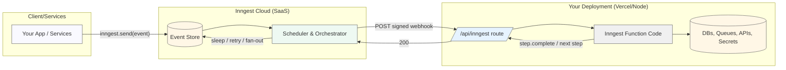
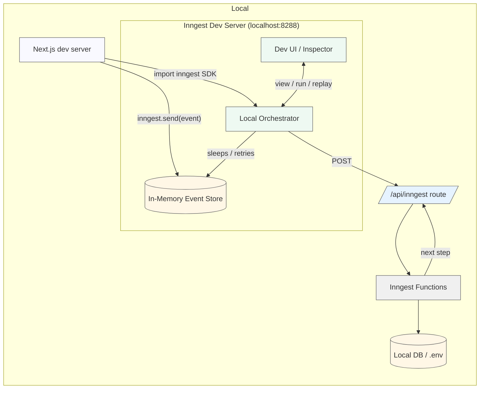
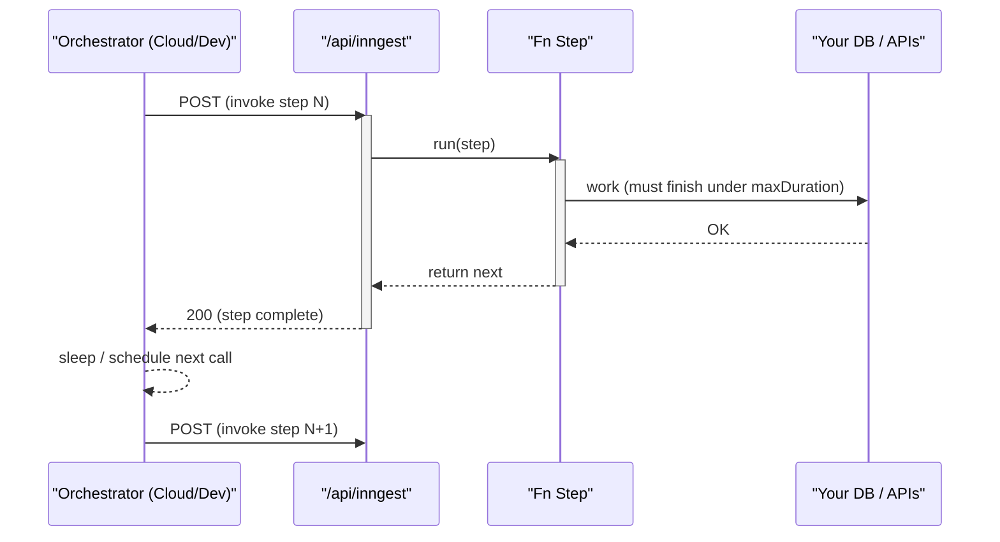

Here are the corrected Mermaid diagrams (fixed subgraph titles, participant names, and message text so they render reliably):

---

## 1) Production (Inngest Cloud orchestrating Next.js)

---

## 2) Local Development (All on your machine)

---

## 3) Request/Step Timing Model (Vercel/Serverless)

