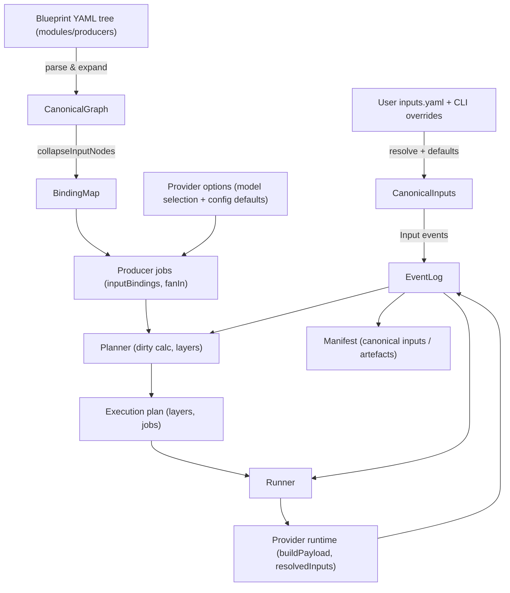

# Canonical IDs End-to-End

This document explains how canonical IDs move from authored assets (YAML/TOML/inputs) through planning, manifests, and provider execution.

## Sources and canonicalization
- **Blueprint YAML** (`cli/config/blueprints/**`): parsed into a tree (`core/src/blueprint-loader/yaml-parser.ts`). Inputs/artefacts/producers keep their namespace path. Edges are inferred when models[] is present. During canonical expansion (`canonical-expander.ts`) module-level inputs wired to an upstream input are collapsed to that upstream canonical ID; `inputBindings` remember the authored alias.
- **Inputs file** (`inputs.yaml` + CLI overrides): parsed with `createInputIdResolver` (`core/src/canonical-ids.ts`) so every key becomes a canonical ID. Model selections and per-model configs are flattened into producer-scoped canonical inputs (`Input:<namespace>.<producer>.<field>`). Defaults are applied via provider options before planning.
- **System injections** (`MovieId`, `StorageRoot`, `StorageBasePath`): added as canonical IDs in `cli/src/lib/build.ts` if not already present.

## Planning and dirty detection
- The planning service (`core/src/planning/service.ts`) writes input events using only canonical IDs, seeds blueprint defaults, and builds the canonical graph (`canonical-graph.ts` → `canonical-expander.ts`).
- Producer jobs carry:
  - `inputs`: full canonical IDs (with dimensions) from edges + selection/config inputs.
  - `inputBindings`: alias → canonical mappings so providers can refer to authored names without fallbacks.
  - `fanIn`: resolved collections keyed by canonical IDs.
- Dirty calc:
  - Inputs: base canonical ID (dimensions removed for user inputs) is compared against manifest input hashes.
  - Artefacts: full canonical artefact IDs (including dimensions) are compared; a change in `Artifact:ScriptProducer.NarrationScript[segment=1]` only dirties consumers of that exact artefact.
  - Dirty jobs propagate downstream via producer graph edges.

## Execution and provider runtime
- Runner resolves artefacts for the exact canonical IDs in a job and merges them into `context.extras.resolvedInputs`; non-canonical keys are ignored.
- Provider runtime (`providers/src/sdk/runtime.ts`) looks up values strictly by canonical IDs via `inputBindings` and `sdk.buildPayload`. No alias/fallback lookup is performed.
- Manifest/event log persist only canonical IDs that were present in input events and produced artefact events.

## Invariants
- All user/system inputs and persisted events use canonical IDs (`Input:...` / `Artifact:...`).
- Alias handling is centralized in `canonical-expander.collapseInputNodes`; after that point only canonical IDs flow.
- Model/provider selections and config properties become first-class canonical inputs so edits mark the right subtrees dirty.
- Blueprints remain author-friendly (short names); canonicalization happens in loaders/resolvers, not in the YAML itself.
